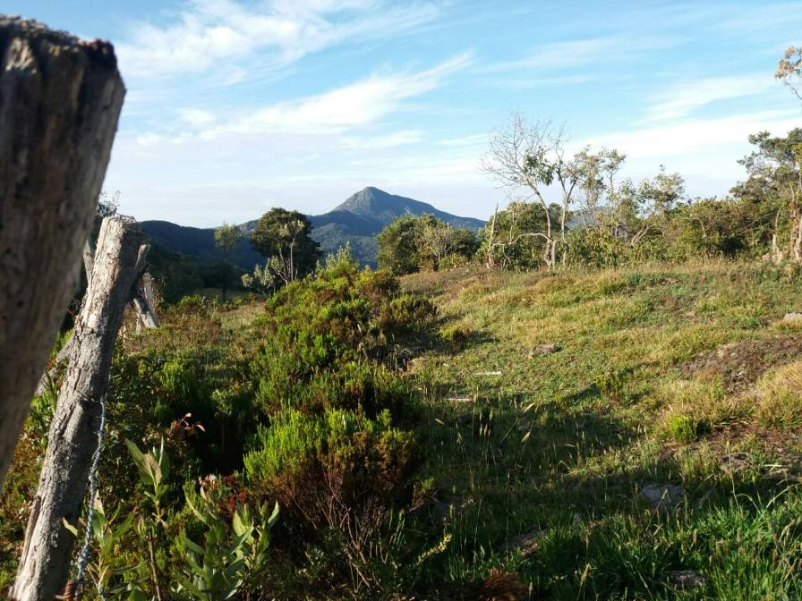

# Happy  Cows 🐮🐮🐮

## A GPS-based cow-tracker application implementing the LoRaWAN&reg; communication technology (backend)

 
<!--  -->

Our cows enjoy gorgeous views and roam around freely at 3300 m.a.s.l in the Colombian Andes. The freedom and meditative scenery in the evergreen mountains comes at a price; the location is remote, and accessing it is difficult.

We care a great deal about our cows and want to make sure they are always safe and sound. That is why we decided to implement a tracking solution. On the one hand, we want to find them when they venture into the forest. On the other hand, we want to establish when a cow is not moving and requires assistance. 

<!--   -->
<!-- 
 -->

The trackers are based on GPS and implement the [LoRaWAN&reg;](https://lora-developers.semtech.com/library/tech-papers-and-guides/lora-and-lorawan/) protocol. 

The backend is responsible for:

* Getting the uplink messages from TTN.
* Storing positions to a database
* Determining whether a cow is moving or not
* Determining whether a device is working properly; namely, that the battery level is OK and the device is sending periodically.
* Sending emails whenever one of the following conditions occurs:
    * A cow is not moving
    * A cow is too far away
    * A device is malfunctioning 

# Credits and Acknowledgements

* Pictures: Fernando Sandoval.
* Edgar and Fernando Sandoval were responsible for testing and deploying the solution.
* Big thanks to Frank Höring who helped us a big deal setting up the trackers.