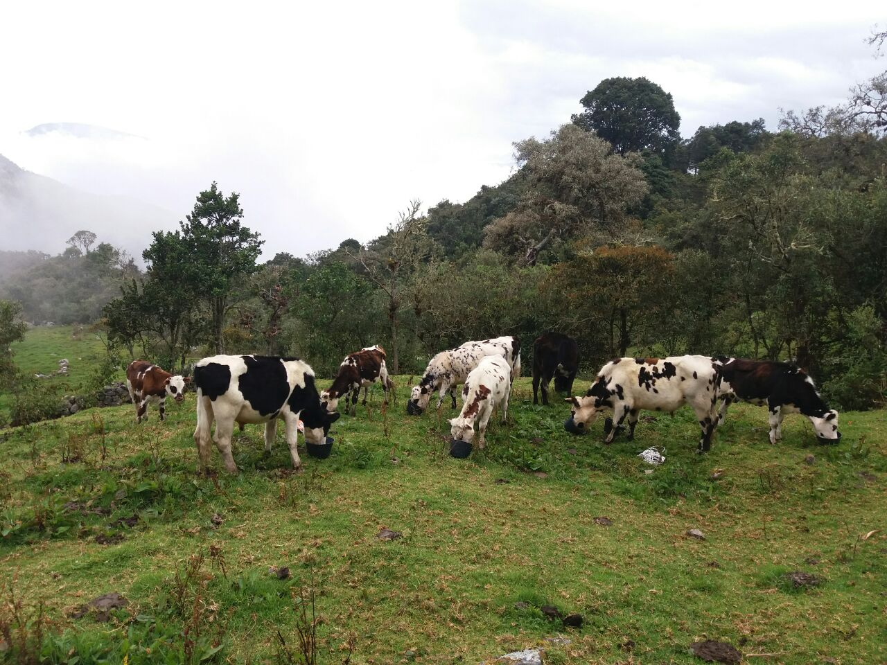
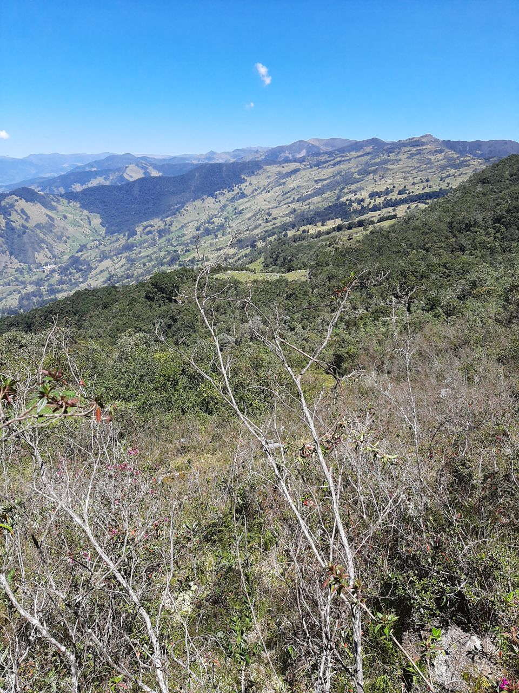

# Happy Cows 🐮🐮

## A GPS-based cow-tracker application implementing the LoRaWAN&reg; technology (backend)

 
 

Our cows enjoy gorgeous views and roam around freely at 3300 m.a.s.l in the Colombian Andes. The freedom and meditative scenery in the evergreen mountains comes at a price; the location is remote, and accessing it is difficult.

We care a great deal about our cows and want to make sure they are always safe and sound. That is why we decided to implement a tracking solution. On the one hand, we want to find them when they venture into the forest. On the other hand, we want to establish when a cow is not moving and requires assistance. 

 

[LoRaWAN&reg;](https://lora-developers.semtech.com/library/tech-papers-and-guides/lora-and-lorawan/)

# Credits
* Pictures: Fernando Sandoval
* Cow icon
* 